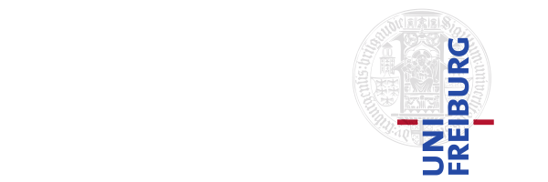

# About

## Authors

ODYM was originally developed by [Stefan Pauliuk](https://www.linkedin.com/in/stefan-pauliuk-6b93b919/) as part of his work at the Faculty of Environment and Natural Resources, University of Freiburg, Germany, and [Niko Heeren](https://www.linkedin.com/in/nikoheeren/).

A number of colleagues have contributed to ODYM since its original release. We acknowledge the feedback and input of [Tomer Fishman](https://www.linkedin.com/in/tomer-fishman/) and [Sebastiaan Deetman](https://www.linkedin.com/in/sdeetman/) (both CML Leiden, The Netherlands), [Fabio Carrer](https://www.linkedin.com/in/fabio-carrer-b870141b7/) (IndEcol NTNU Trondheim, Norway), [Christian Hauenstein](https://www.linkedin.com/in/christian-hauenstein-036422366/) (University of Freiburg, Germany), [Michael Weinold](https://www.linkedin.com/in/michaelweinold/) (PSI and ETH Zurich, Switzerland), [Chris Mutel](https://www.linkedin.com/in/christopher-mutel-61b263b2/) (PSI and Départ de Sentier), and more.



## Funding

The work of Stefan Pauliuk was supported by grant no. 7635.521(15) of the [Ministry of Science, Research and the Arts of Baden-Württemberg](https://mwk.baden-wuerttemberg.de/en/home) (Germany).

## Journal Publications

Pauliuk and Heeren (2019),
"ODYM—An open software framework for studying dynamic material systems: Principles, implementation, and data structures",
_Journal of Industrial Ecology_,
[doi:10.1111/jiec.12952](https://doi.org/10.1111/jiec.12952).
 

## License

```plaintext
--8<-- "LICENSE.txt"
```