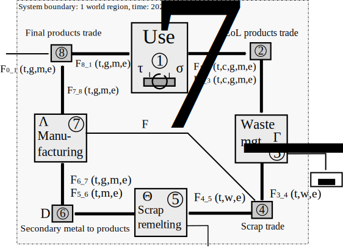

# ODYM – Open Dynamic Material Systems Model

The Open Dynamic Material Systems Model (ODYM) is an open source framework for material systems modeling programmed in Python. The description of systems, processes, stocks, flows, and parameters is object-based, which facilitates the development of modular software and testing routines for individual model blocks. ODYM MFA models can handle any depth of flow and stock specification: products, components, subcomponents, materials, alloys, waste, and chemical elements can be traced simultaneously. ODYM features a new data structure for material flow analysis; all input and output data are stored in a standardized file format and can thus be exchanged across projects. It also comes with an extended library for dynamic stock modeling.

Download this file [file](tutorial_1.ipynb){: download }

