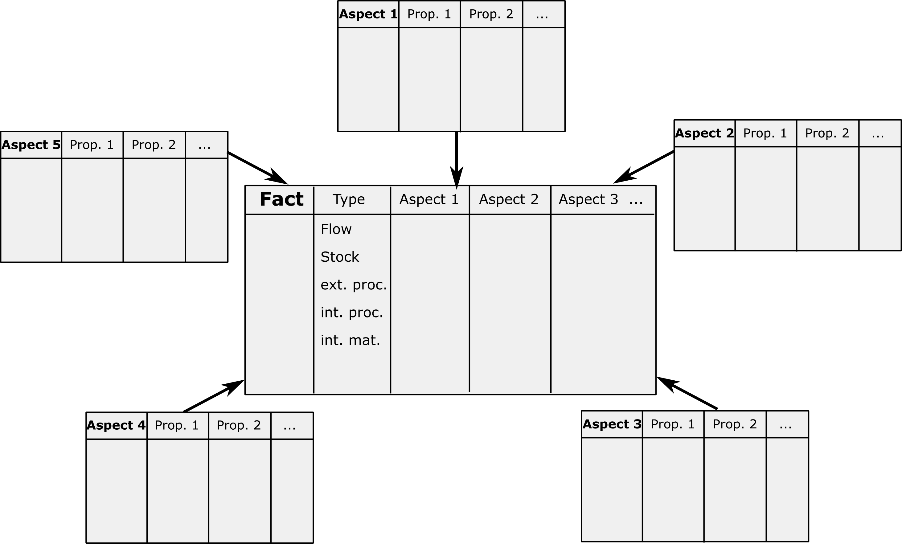

# Data Structure

This page explains the ODYM data model and database structure.
[Tutorial 4](../tutorials/tutorial_4.ipynb) shows a simple example of formatting and parsing data in the framework.

## Basic data categories for material and energy flow accounting
Material and energy flow accounting describes the formatting of raw and derived measurement and statistical data into a systems context. It forms the basis of development of models for industrial ecology, including process parameters (e.g., efficiency), product and material parameters (e.g., composition), unallocated and allocated unit process models, life cycle databases, etc. The basic system structure is a graph of nodes for transformation, distribution, and storage of objects and edges that represent flows between nodes. A database has to describe the system structure (which nodes and edges are present) and the nodes and the flowing objects themselves. 

Data on products, processes, and events enter the system model via a data model. System variables and parameters describe mass, stock, flow, composition, lifetime, efficiency, etc. of the system elements. These data together form a [data warehouse](https://en.wikipedia.org/wiki/Data_warehouse), and the ODYM data warehouse is built on the following broad categories of description, which are established in Pauliuk et al. (2016).

__Category 1)__ Split according to function in the system graph
+ Data describing objects (products, materials, commodities, goods, 'stuff')
+ Data describing processes (capacity, efficiency, location, ...)

__Category 2)__ Split according to scaling of data
+ Extensive data: Describe system at scale (total amount, value, energy, ...)
+ Intensive data: Describe processes and objects at per unit level (specific fuel consumption, elemental composition of materials, ...)

__Category 3)__ Split according to relation to system as a whole
+ Extrinsic data: Those that must be located in the system to make sense (actual stocks and flows, capacities, ...)
+ Intrinsice data: Those that exist independent of the systems context (nominal (on paper) fuel efficiency and material composition of specific vehicle types, standardized element composition of alloys, country ISO codes, ...)

__Category 4)__ Unobserved data
+ Unobservable or unobserved model parameters (allocation keys, ...)
+ Unobservable indicators depending on systems context (life cycle emissions, criticality measures, ...)
+ Scenario data (Future population, product material composition, ...)

## Basic data model of material and energy flow accounting:
Each extrinsic dataset needs to be located in the system. The system location of data is achieved by specifying the _system dimensions_ or _system aspects_ of the data. The lifetime of goods, for example, depends (at least) on the following aspects: the type of good, the year it was produced, and the region where it is used. Other examples for extrinsic data include:

* Lifetime(product, product type, region of use, year of production, scenario)
* Remelting yield (remelting process, chemical element, secondary alloy)
* (Trade) Flow (commodity, year, origin region, destination region, destination sector)
* (In-use) stock (processs of residence, material, time stamp)

The extrinsic data have general data structure: X(aspect1, aspect2, aspect3, ...). Each dataset can be desribed as mapping (function) from the multidimensional aspect space into the co-domain of the dataset, which is usually a subset of the real numbers. In database engineering such a multidimensional data structure is called [OLAP cube](https://en.wikipedia.org/wiki/OLAP_cube) or data cube; it was introduced to material and energy flow accounting by Löfving et al. (2006) and Lupton and Allwood (2017).

###  The star schema database

The tupel structure X(aspect1, aspect2, aspect3, ...) can be implemented in different database types. Multi-aspect data can be stored as multidimensional arrays with each dimension corresponding to a single index (done in ODYM using numpy.array), partly flattened arrays with multiindices for rows and/or columns (typical storage format of multiregional input-output tables), or lists of data indexed by tuples. For the latter two formats, Excel templates and parsing routines were developed as part of ODYM, which allow for using any number of aspects, storing and parsing incomplete and overlapping data, and using custom order of data and indices. The input data need to be indexed by indices present in the model classification but the exact shape and order of the data is flexible. 

The storage of multidimensional data in tuples is called a [star schema database](https://en.wikipedia.org/wiki/Star_schema). A star schema database has a central element, which is a table of all data to be described by tuples of different aspects/dimensions. In this table the observation and derived data such as stocks, flows, composition, etc. can be recorded, each dataset in its type-specific dimensions. Each aspect or dimensions is then link to a custom dimesion table, which form the edges of the star and which contain the _intrinsic_ information about the different dimensions.

__Figure.__ Star Schema database, with Fact table at the center and aspect/dimension tables arranged around the fact table.

## Five generic types of extrinsic data
Extrinsic data can be split according to categories 1 and 2 (cf. above), which leaves us with four generic data types:
+ Extensive data on objects (How much 'stuff' is where in the system?)
+ Extensive data on nodes (How 'big' are the nodes?)
+ Intensive data on objects (What is the composition of 'stuff' and other per unit properties (price, lifetime, ...) at different places in the system?)
+ Intensive data on nodes (What is the efficiency/yield of the different nodes in the system?)

Depending on the time frame of the study and the resolution of the system definition the 'stuff' in the system appears as stocks ('stuff' in a certain compartment) or flows ('stuff' between different compartments).

In total we are left with the following five generic data types (+ examples):
+ Flows (extensive data on objects) (How much 'stuff' flows from where to where in the system?)
+ Stocks (extensive data on objects) (How much 'stuff' is located where in the system?)
+ Extensive data on nodes (Capacity or size (area) or nodes/processes/industries.)
+ Intensive data on objects (Material composition, lifetime, prices, etc. of 'stuff' at different places in the system)
+ Intensive data on nodes (Process efficiency, yield, ownership of the different nodes/industries/transformation processes in the system)

All data of these types are stored in tuples Fact(aspect 1, aspect 2, ...). To define a database all relevant aspects for a database and project need to be defined. 

## Summary and implementation in ODYM
The extrinsic data are modeled as different data cubes, and together they form a [data warehouse](https://en.wikipedia.org/wiki/Data_warehouse) for the project. In MFA the use of common classifications is not widely spread, and each project will have its own local classifications. For efficient data handling in larger projects there must be some agreement as to which products, regions, etc. are used. In ODYM, all different data aspects are described using discrete project-wide classifications. For example, a list of regions, processes, products, alloys, or waste types is agreed upon. These classifications are stored in a central file. Primary data need to be mapped to this classification, a step that happens outside ODYM. Model input data must follow the project-wide classifications for each aspect.

Examples of the data templates are provided on the Data Templates page of this wiki.
A related project is the [IE data inventory](https://docs.google.com/spreadsheets/d/1yupwhtfUiBnW5DcAzOTek03gxzH22hDzn_djzwocDGA/edit), where literature data are inventorized according to their respective aspects and types.

## References

Löfving, E., A. Grimvall, and V. Palm. 2006. Data Cubes and Matrix Formulae for Convenient Handling of Physical Flow Data. Journal of Industrial Ecology 10(1–2): 43–60.

Lupton, R.C. and J.M. Allwood. 2017. Hybrid Sankey diagrams: Visual analysis of multidimensional data for understanding resource use. Resources, Conservation & Recycling 124(October 2016): 141–151. [doi:10.1016/j.resconrec.2017.05.002](https://doi.org/10.1016/j.resconrec.2017.05.002).

Pauliuk, S., G. Majeau-Bettez, E.G. Hertwich, and D.B. Müller. 2016. Toward a Practical Ontology for Socioeconomic Metabolism. Journal of Industrial Ecology 20(6): 1260–1272.