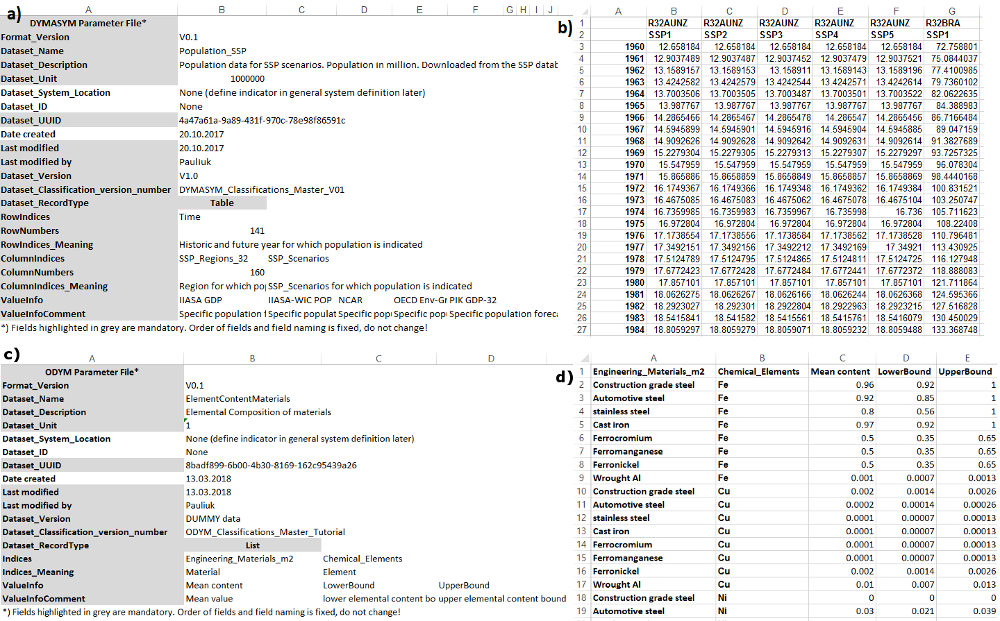

# Data Templates

This page explains the use of the ODYM data templates.
[Tutorial 4](../tutorials/tutorial_4.ipynb) shows a simple example of formatting and parsing both table-based and list-based data. [Tutorial 5](../tutorials/tutorial_5.ipynb) contains a complete MFA study using the ODYM data templates and dynamic stock modelling.

The ODYM data structure is closely linked to its index structure. Any system variable or parameter that can be described as a collection of metadata, values, and uncertainty in tuple form can be stored in the ODYM data templates and directly loaded into the model. The different system variables and parameters are stored in objects where Metadata is a Python dictionary and the values and uncertainty datasets are multidimensional arrays with one dimension for each aspect. 

For data in the ODYM structure two Excel templates were created. A screenshot of two sample data files is shown in the figure below. Each template contains the metadata in predetermined locations and the actual data and uncertainty ranges. Metadata include the aspects/dimensions used and how they are split on rows and columns of the data table. 

The example in the figure contains the metadata and the data for the population estimates for the five different SSP (socioeconomic pathways) scenarios and the 32 SSP regions, formatted after being downloaded from the SSP scenario database (39) and for a product lifetime parameter. Part (a) shows the population metadata, including the aspects/dimensions used and how they are split on rows and columns of the data table. The field `RowIndices` has only one entry `time`, which means that there is only one index level for the rows of the data table. The field `ColumnIndices` has two entries `SSP_Regions_32` and `SSP_Scenarios`, which means that the columns of the data table have a multi-index, with the 32 SSP regions as the top and the five SSP scenarios as the bottom level. Figure part (b) shows the actual data and their indexing. Parts (c) and (d) show the metadata and list-type data for a lifetime parameter, respectively.

If the parameters are formatted correctly and their values are given in the same classifications as used for the model run, ODYM is able to parse all data using the index matching information (which dataset index corresponds to which model index letter) contained in the model configuration file. All quantitative information enters the model via parameter template files from the ODYM database.